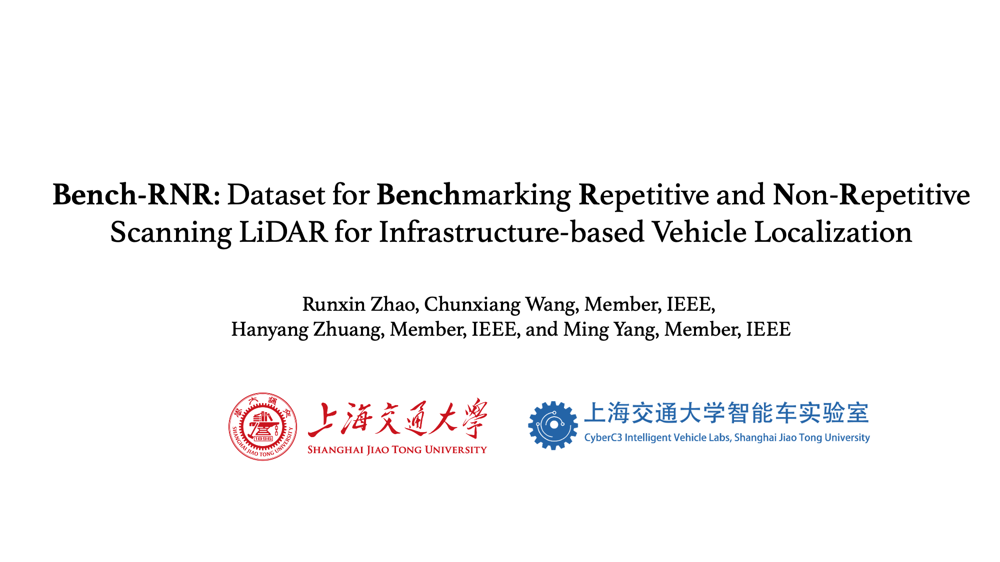

# BenchRNR: Dataset for Benchmarking Repetitive and Non-repetitive Scanning LiDAR for Infrastructure-based Vehicle Localization

## 1. Introduction

BenchRNR is a point cloud dataset for Infrastructure-based Vehicle Localization with both repetitive  and non-repetitive scanning LiDAR, in an effort to benchmark the performance of different LiDAR scanning patterns. It also provides the code for four typical vehicle pose estimation methods: 

+ point cloud segmentation + oriented bounding box (Seg+obb)
+ point cloud segmentation + convex-hull-based vehicle pose estimation method (Seg+obb)
+ point cloud segmentation + vehicle point cloud template registration (Register-Loc)
+ point cloud object detector PV-RCNN (PV-RCNN)

### Related Video
Our accompanying videos are now available on **YouTube** (click below images to open).

## 2. Dataset Download

Our data is released in the form of rosbags. There are eight rosbags in total, containing 5,428 frames of LiDAR point clouds. The sensor configuration including:

+ one repetitive scanning LiDAR (OT-128, 10Hz)
+ two non-reptitive scanning LiDAT (Livox Avia, 10Hz)
+ two camera (USB camera, 10Hz)

 Download the data from [[BenchRNR Datasets](https://pan.sjtu.edu.cn/web/share/b48de37f470fb8a3d1f886c41495ee78)]

## News
+ 2025-5-8:Release Dataset at [[BenchRNR Datasets](https://pan.sjtu.edu.cn/web/share/b48de37f470fb8a3d1f886c41495ee78)].

## Acknowledgements
The realization of convex-hull-based vehicle pose estimation method is built on [CH-MOA-ROS](https://github.com/HMX2013/CH-MOA-ROS)

PV-RCNN is trained by [OpenPCDet](https://github.com/open-mmlab/OpenPCDet.git) using roadside point cloud data from [DAIR-V2X-I](https://github.com/AIR-THU/DAIR-V2X). 

